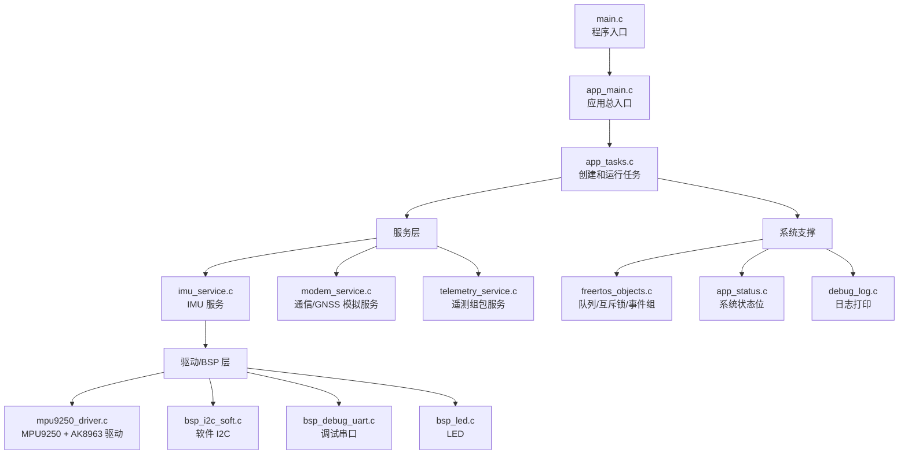
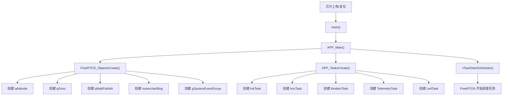
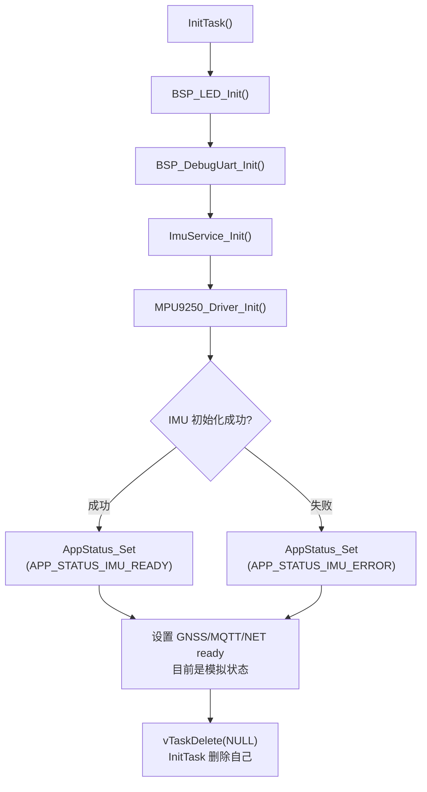
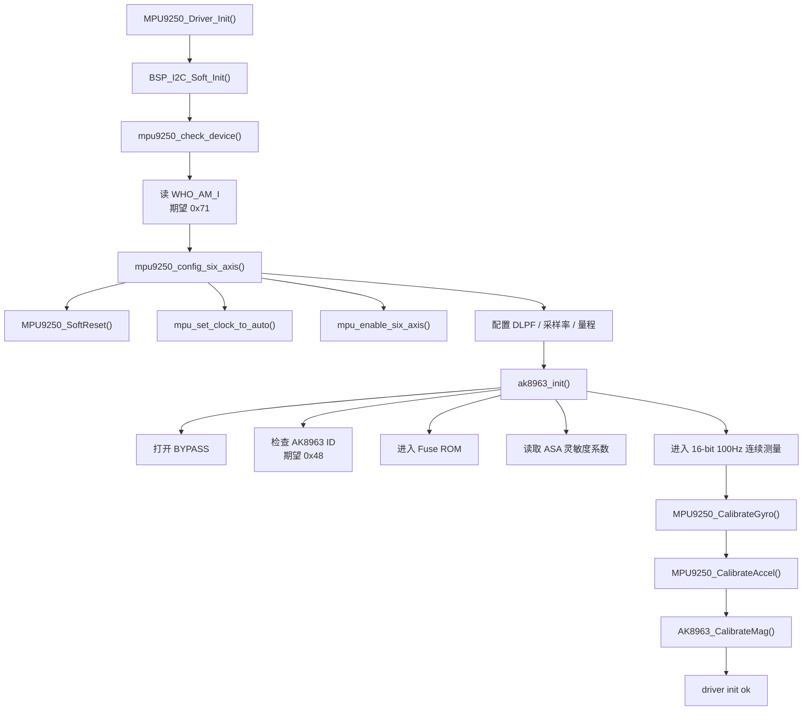
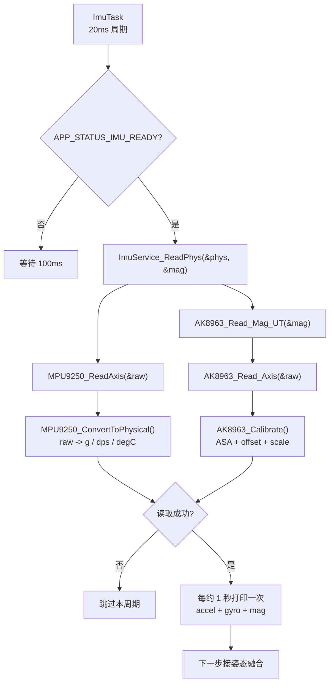
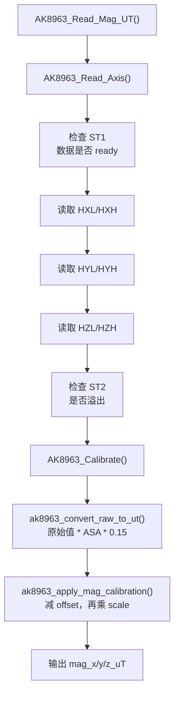
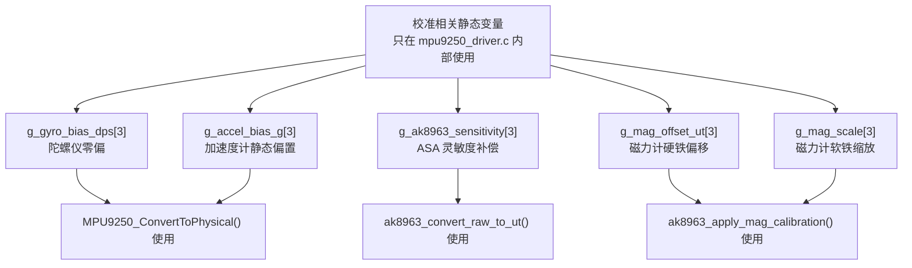
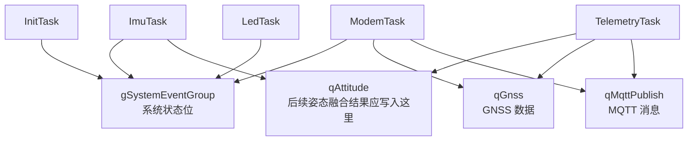
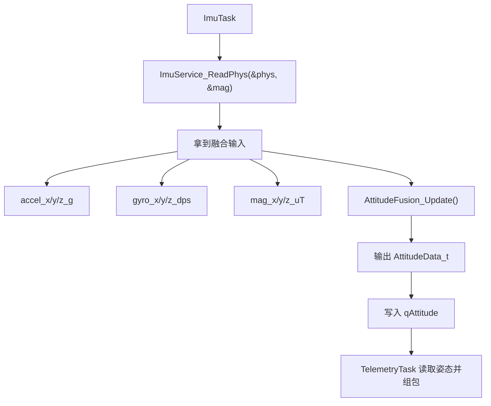

# AeroPush 工程流程图

之前那版第一张图太宽，Typora 会自动缩小到整页宽度，所以几乎看不见。现在改成“窄图 + 分段图”，每张图只讲一件事，适合直接在 Typora 里看。

## 0. 怎么看

如果图还是偏小，可以在 Typora 里按：

```text
Ctrl + 鼠标滚轮向上
```

或者点菜单：

```text
视图 -> 放大
```

## 1. 总体分层



## 2. 上电启动流程



## 3. InitTask 做了什么



## 4. MPU9250_Driver_Init 内部流程



## 5. IMU 周期读取流程



## 6. 磁力计读取和校准关系



## 7. 三个校准值放在哪里



## 8. FreeRTOS 任务之间的数据关系



## 9. 姿态融合应该接在哪里



建议后面新增：

```text
User/Inc/attitude_fusion.h
User/Src/attitude_fusion.c
```

这样 `ImuTask` 只负责周期调度，融合算法单独放在 `attitude_fusion.c`，工程会更清楚。
